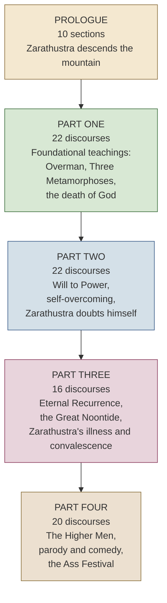
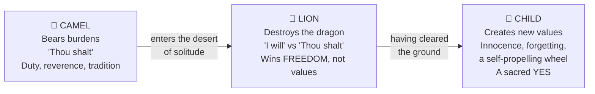
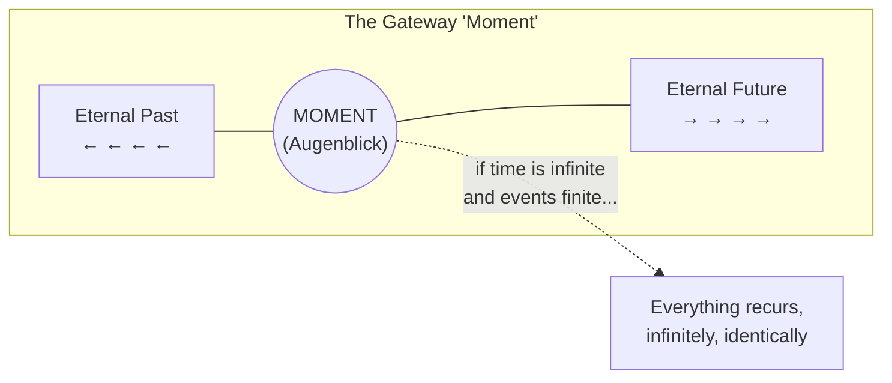
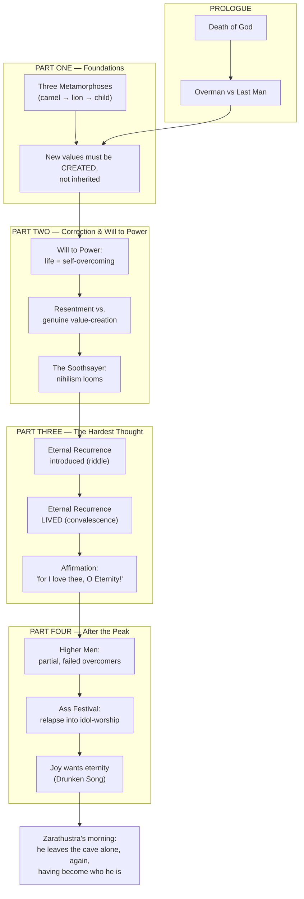

# Walking Down the Mountain: My Deep Dive Into *Thus Spoke Zarathustra* — The Prologue and the ~80 Sermons That Follow

*A long-form reading guide, part-by-part breakdown, and personal commentary on Friedrich Nietzsche's strangest, most poetic book*

---

## Why I'm Writing This

I've read *Thus Spoke Zarathustra* three times now, and each time I've come away with a different book in my hands. The first time, I read it like a philosophy student hunting for "the argument" — and I finished frustrated, because Nietzsche doesn't give you one. The second time, I read it like a novel, and it worked better, though I kept losing track of who Zarathustra was actually talking to. The third time, I stopped trying to pin it down and just let it be what it is: part scripture parody, part prose-poem, part stand-up routine, part fever dream.

That third reading is the one I want to share with you.

This post is my attempt to walk through the **Prologue** in real detail — section by section — and then survey the roughly **eighty discourses ("sermons")** that make up the four parts of the book. I'll give you tables to orient yourself, diagrams to visualize the structure, a small tested Python script for anyone who wants to poke at the text programmatically, and a running set of notes and cautions, because this book has a genuinely dangerous reception history that I think every reader should know about before diving in.

I am not a Nietzsche scholar. I'm a reader who fell hard for this book and wants to help you find your own way into it without drowning. Where I say something contested, I'll flag it. Where translators disagree, I'll show you the disagreement instead of hiding it.

Let's climb the mountain.

---

## Table of Contents

1. What Kind of Book Is This, Actually?
2. Quick Orientation: Nietzsche and the Writing of *Zarathustra*
3. The Structure of the Book at a Glance
4. The Prologue, Section by Section
5. The Five Ideas You Need Before Part I
6. Part One: The Discourses (a full table + deep dives)
7. Part Two: The Discourses (a full table + deep dives)
8. Part Three: The Discourses (a full table + deep dives)
9. Part Four: The Discourses (a full table + deep dives)
10. A Conceptual Map of the Whole Book
11. Tested Code: A Small Python Tool for Exploring the Text
12. Notes, Cautions, and Common Misreadings
13. Translations Compared
14. How I'd Actually Read This Book If I Were Starting Today
15. Closing Thoughts

---

## 1. What Kind of Book Is This, Actually?

Before I get into the content, I want to be upfront about genre, because genre confusion is what wrecks most first readings.

*Thus Spoke Zarathustra* (German: *Also sprach Zarathustra*) is not a treatise. It doesn't build an argument brick by brick the way *Beyond Good and Evil* or *On the Genealogy of Morals* do. It's closer to a **philosophical novel written in the voice of scripture** — Nietzsche is deliberately mimicking the King James Bible's cadence and Luther's German Bible translation, chapter titles and all ("Of This and That," in the old style), while putting a prophet named Zarathustra through a loose narrative arc.

> **Note:** The name "Zarathustra" is borrowed from the historical founder of Zoroastrianism (the Persian prophet Zoroaster), but Nietzsche's Zarathustra is not the historical figure. Nietzsche picked the name because the real Zoroaster was, as far as Nietzsche understood him, the first thinker to frame existence as a moral battle between good and evil — and Nietzsche wanted *his* Zarathustra to be the one who takes that mistake back and overcomes it. It's a joke with philosophical teeth: the inventor of moral dualism returns to undo what he started.

So structurally, you get:

- A **Prologue** that reads like a compact myth or parable — Zarathustra comes down from his mountain, tries to preach to a crowd, and fails spectacularly.
- Four **Parts**, each made up of many short chapters. These chapters are the "sermons" or "discourses" — short, titled, often beginning "Of..." (in older translations) or with a plain noun phrase (in newer ones), delivered by Zarathustra to disciples, animals, or himself.
- No consistent plot machinery. Characters appear and vanish. Time is vague. It's structured more like a series of **movements in a piece of music** than chapters in a novel.

If you count the Prologue's ten sections plus the discourses across all four parts, you land somewhere in the neighborhood of **80 titled pieces** total — which is where the "80 sermons" framing in the title of this post comes from. Depending on the edition and how you count subsections, people cite numbers between 76 and 82; I'll give you the precise count per part below.

---

## 2. Quick Orientation: Nietzsche and the Writing of *Zarathustra*

I'll keep this section short because this post is about the text, not the biography, but a little context helps.

Nietzsche wrote the four parts of *Zarathustra* between 1883 and 1885, in short, intense bursts — he claimed to have written Part One in about ten days. He considered it his masterpiece and, frankly, his gift to humanity; in *Ecce Homo* he calls it "the highest book there is." That confidence is worth holding onto as you read, because the book is strange enough that it's easy to assume you're missing something obvious. Sometimes you are. Sometimes Nietzsche is just being deliberately oracular.

He originally planned a fourth part as a kind of satirical epilogue and had trouble finding a publisher willing to print it — he ended up privately printing a small number of copies of Part Four and handing them out to friends. That off-kilter, semi-orphaned quality of Part Four (much more comic, much stranger) makes sense once you know it was never meant to sit as comfortably in the canon as the first three parts.

> **Caution:** Nietzsche never finished a "Part Five." Some of his unpublished notebooks from this period were later assembled and published posthumously by his sister, Elisabeth Förster-Nietzsche, as *The Will to Power* — a book Nietzsche never authorized in that form, and one that was later shaped to fit her husband's nationalist and antisemitic politics. I'll come back to this in the cautions section, because it matters a lot for how *Zarathustra* got misread in the 20th century.

---

## 3. The Structure of the Book at a Glance

Here's the map before we start walking.

| Part | German Title (short) | Written | Number of Discourses | Tone |
|---|---|---|---|---|
| Prologue | *Zarathustras Vorrede* | 1883 | 10 sections (not usually counted as separate "discourses") | Mythic, narrative, parabolic |
| Part One | *Erster Teil* | Written Jan–Feb 1883 | 22 discourses | Didactic, aphoristic, closest to a "sermon collection" |
| Part Two | *Zweiter Teil* | Written June–July 1883 | 22 discourses | More combative, more self-doubting, introduces the "Soothsayer" and hints of the eternal recurrence |
| Part Three | *Dritter Teil* | Written Jan 1884 | 16 discourses | Darkest, most intense; the eternal recurrence is confronted head-on |
| Part Four | *Vierter Teil* | Written 1885 | 20 discourses | Comic, strange, populated by the "higher men"; written last and separately |

That's **10 + 22 + 22 + 16 + 20 = 90 pieces** if you count the Prologue's ten sections individually, or **80 discourses proper** if you count only the titled chapters across the four Parts and treat the Prologue as a single unit. Both countings are used in the secondary literature, which is exactly why you'll see "eighty sermons" floating around as shorthand — it's the discourse count across Parts One through Four.



---

## 4. The Prologue, Section by Section

This is the part I want to spend the most time on, because I think it's the single best-constructed piece of writing Nietzsche ever produced, and because almost everyone who "knows about" *Zarathustra* secondhand actually only knows the Prologue — the tightrope walker, "God is dead," the overman, the last man. If you get the Prologue solidly, you have the key that unlocks everything after it.

The Prologue has ten numbered sections. I'll walk through each.

### Prologue §1 — The Descent

Zarathustra is thirty years old when he leaves his home and goes into the mountains, where he lives in a cave with his two animals — an eagle and a serpent — for **ten years**, enjoying his solitude and his own spirit. One morning, he rises with the dawn, goes outside, addresses the sun directly, and announces that he is, like the sun, "overrich" with wisdom and light, and that — like the sun, which must set each evening to give its light to the world below — he must **go down** ("*untergehen*," which also carries the sense of "go under" or "perish") and share what he has accumulated.

> **My take:** That German pun — *untergehen* meaning both "go down" (as the sun does) and "go under / perish" — is doing enormous work in this one paragraph, and it's basically untranslatable. Every act of giving, for Zarathustra, is simultaneously a form of overflowing generosity and a kind of death. Keep that double meaning in your pocket; it recurs constantly.

### Prologue §2 — The Old Saint in the Forest

On his way down, Zarathustra meets an old hermit-saint in the forest who has, coincidentally, also chosen to withdraw from humanity — but for the opposite reason. The saint loved men once, grew disillusioned, and now loves only God, spending his days composing songs and praising his deity in the woods. He warns Zarathustra not to bother going down to "men" — they'll receive nothing but suspicion from him, he says; better to stay with the animals as he himself has done.

Zarathustra, once alone again, has a moment of genuine astonishment:

> "Could it be possible! This old saint in the forest hath not yet heard of it, that **God is dead**!"

This is the first appearance of the line that would become the book's most famous export into pop culture. Note the framing carefully: it's not delivered as a thunderclap proclamation to the world. It's a private, almost bemused aside — Zarathustra is more surprised that news this old hasn't reached the saint than he is invested in announcing it as news.

### Prologue §3 — The Marketplace and the Tightrope Walker

Zarathustra arrives at a town called "The Motley Cow" and finds a crowd gathered in the marketplace to watch a tightrope walker perform between two towers. Seeing his opening, Zarathustra addresses the crowd — and this is where he gives his first great public speech, "**I teach you the Overman**" (*Übermensch*, sometimes translated "Superman" in older translations, which I'd gently steer you away from because of the unfortunate comic-book connotation in English).

His central images here are the ones people remember even if they've never opened the book:

- **Man is a rope stretched between animal and Overman** — a rope over an abyss.
- **Man is something that must be overcome.** What have you done to overcome him?
- The Overman is "the meaning of the earth" — and Zarathustra pleads with the crowd to *remain faithful to the earth* rather than believing in "superearthly hopes."

The crowd, however, is not there for a sermon. They think he's part of the tightrope act and start laughing, assuming he's introducing the performer.

> **Note on terminology:** *Übermensch* is one of the most contested translation choices in all of philosophy. "Superman" (used by the earliest English translator, Thomas Common) carries superhero baggage no German reader would have felt in 1883. "Overman" (Kaufmann's choice, largely standard now) is closer but still a bit flat. Some recent translators use "beyond-man" or leave it untranslated. The core idea is someone who has overcome ("*über*" = over/beyond) the current, still largely animal-bound condition of humanity — not a being of superior strength or comic-book powers.

### Prologue §4 — The Last Man

Seeing that the crowd isn't following the Overman speech, Zarathustra tries a different rhetorical tactic: contrast. He describes **the Last Man** — a figure who has abandoned all striving, all danger, all great love and great contempt, in favor of comfort, safety, and a kind of shrunken, blinking contentment. "We have discovered happiness," say the Last Men, blinking.

This backfires *spectacularly* — in the best possible way for the book's argument, if not for Zarathustra's ego. The crowd, hearing this description of a life of total comfort and risk-free contentment, **cheers**. They want to *be* the Last Man. "Give us this last man, O Zarathustra... we do not want to become the Overman!"

> **My take:** I think this is one of the most quietly devastating jokes in all of philosophy. Zarathustra means the Last Man as a warning, a nightmare vision, and the crowd receives it as a sales pitch. It's a joke about how satire fails when the audience isn't in on it — and it's also Nietzsche needling his own readers in advance, daring us to make sure we're not the crowd.

### Prologue §5 — The Fall of the Tightrope Walker

Just as the crowd's mockery peaks, the actual tightrope walker begins his performance. A jester (or "buffoon" — a second, mocking tightrope figure) leaps out behind him, taunts him, and vaults over him; the terrified tightrope walker loses his balance and falls to his death near where Zarathustra stands.

Dying, the man says he always knew the devil would trip him and that he expected nothing after death — "you speak no more than the truth" — that he is "no more than an animal that hath been taught to dance by blows and scanty fare." Zarathustra comforts the dying man directly, telling him there is no devil and no hell, that his soul will be dead even sooner than his body, and that he should fear nothing more.

> **My take:** The tightrope walker is a small, quiet tragedy tucked inside a book about grand transformation, and I think that's the point. He *lived* the central metaphor of the whole book — man as a rope over an abyss — and it killed him. Zarathustra doesn't mock him for failing to become the Overman; he treats him with real tenderness. Danger without a *why*, without meaning, is just danger. That distinction — risk in service of something versus risk for its own sake — becomes important later.

### Prologue §6 — Night Falls, the Crowd Disperses

Night comes on; the crowd, now bored and a little spooked by the corpse, disperses. Zarathustra is left alone with the body. He resolves to carry it away and bury it himself, since no one else will. On the road, the jester who caused the fall catches up to Zarathustra and — half-mockingly, half in warning — tells him to leave town, because the "good and just" hate him, and the believers in the "true faith" think he's a danger to it. He warns Zarathustra that he's fallen "like a stone" through their hatred by rousing the "sleeper" of orthodoxy.

### Prologue §7 — The Grave-Digger's Night Walk

Zarathustra carries the dead man on his back through the dark, hungry, and eventually needs to rest. He reflects that the dead man is now his first "companion" and that the living are stranger company to him at the moment than a corpse. He arrives at a forest and lays the body in a hollow tree to keep it safe from wolves.

### Prologue §8 — Sleep and a New Realization

Zarathustra sleeps and wakes at dawn with new resolve. He realizes what went wrong at the marketplace: **you cannot address a crowd with the highest teaching.** A crowd is not the right instrument.

> "A herd is what this crowd is; it wants a herdsman... Not to the people is Zarathustra to speak, but to companions!"

This is a genuine pivot in the book's whole strategy. Zarathustra decides he will no longer be a "herdsman" or "dog to the herd" — he will seek out **companions**, individuals who will follow him because they want to *create* their own values, not because he's told them what to think.

### Prologue §9 — Companions, Not Disciples

Zarathustra articulates the distinction that will govern the rest of the book: he doesn't want followers who parrot him. He wants **creators** — people who "write new values on new tablets." He compares himself to a farmer who must first find good soil (companions capable of creating) rather than trying to plant in a marketplace crowd (soil that just wants to be told what to grow).

### Prologue §10 — The Sign

As Zarathustra continues on, the sun climbs to noon, and he encounters the sign he'd predicted he would need: an eagle circling in the sky with a serpent coiled around its neck — "not like a prey, but like a friend." The eagle is described as the proudest animal under the sun; the serpent, the wisest. Zarathustra takes this as a good omen and continues down toward the town with renewed purpose, his "hour" having come.

> **Note:** The eagle and serpent return throughout the book as Zarathustra's two animal companions — pride and wisdom in symbiotic, non-predatory relationship. It's worth remembering that image (a proud creature and a wise creature choosing partnership rather than one consuming the other) as a small model, in miniature, for what the Overman is supposed to achieve within a single person: **pride and wisdom cooperating rather than one devouring the other.**

---

### Prologue Summary Table

| # | What Happens | Key Idea Introduced |
|---|---|---|
| 1 | Zarathustra leaves his cave after 10 years of solitude | Overflow/generosity as "going under" (*untergehen*) |
| 2 | Meets the old saint; realizes God is dead | The death of God (first mention) |
| 3 | Speaks to the crowd; teaches the Overman | Man as a rope between animal and Overman |
| 4 | Describes the Last Man; crowd cheers for it | The danger of total comfort and risklessness |
| 5 | The tightrope walker falls and dies | Meaning vs. mere risk; tenderness toward failure |
| 6 | The jester warns Zarathustra to leave | Society's hostility to disruptive truth-tellers |
| 7 | Zarathustra carries the corpse through the night | Solitude, burial, care for the fallen |
| 8 | Realizes he addressed the wrong audience | Herd vs. companions |
| 9 | Resolves to seek companions, not disciples | Creation of new values as the real goal |
| 10 | Sees the eagle and serpent; his hour has come | Pride + wisdom in partnership |

---

## 5. The Five Ideas You Need Before Part I

Before the discourses proper start, it helps to have five recurring concepts pre-loaded, since Nietzsche doesn't define them cleanly anywhere — they accumulate meaning as the book goes on.

| Concept | Rough Definition | Where It's Most Developed |
|---|---|---|
| **The Overman (*Übermensch*)** | A figure who creates their own values instead of inheriting them; affirms life, including its suffering, rather than seeking escape from it | Prologue §3; "Of Self-Overcoming" (Part II) |
| **The Death of God** | The collapse of a culture's inherited metaphysical and moral foundation — not literally about theism, but about the loss of a single, unquestioned source of value | Prologue §2; echoed throughout |
| **Will to Power** | Nietzsche's proposed underlying drive in living things — not simply "desire for domination" but a drive toward growth, mastery, and self-overcoming | "Of the Thousand and One Goals," "Of Self-Overcoming" (Part II) |
| **Eternal Recurrence** | The thought-experiment (posed as if it might be literally true) that you must live your life such that you could will its exact repetition, infinitely, in every detail | "Of the Vision and the Riddle," "The Convalescent" (Part III) |
| **The Last Man** | The imagined endpoint of a civilization that has optimized entirely for comfort and safety, abandoning all striving | Prologue §5 |

I'd genuinely encourage you to reread the table above after finishing the Prologue walkthrough, because every discourse from here forward is, in one way or another, elaborating on one of these five ideas.

---

## 6. Part One: The Discourses

Part One is the closest thing in the book to a structured curriculum — Zarathustra, having decided to seek companions, delivers a sequence of short discourses that read almost like a syllabus of his core teachings. This is the part most commonly excerpted in anthologies.

### Part One — Full Table

| # | Title (Common/Kaufmann style) | One-Line Summary |
|---|---|---|
| 1 | Of the Three Metamorphoses | The spirit becomes camel (burden-bearer), then lion (destroyer of "thou shalt"), then child (creator of new values) |
| 2 | Of the Chairs of Virtue | Satire of academic moral philosophy that teaches people to sleep well rather than live well |
| 3 | Of the Afterworldsmen | Critique of metaphysical "other worlds" as projections born of bodily suffering |
| 4 | Of the Despisers of the Body | The body/self as the deeper reality; "ego" is a tool of the body, not the reverse |
| 5 | Of Joys and Passions | Passions aren't to be killed, but cultivated into virtues |
| 6 | Of the Pale Criminal | A meditation on how society misreads and punishes the criminal's inner logic |
| 7 | Of Reading and Writing | Praise of aphoristic, blood-written wisdom over easy, passive reading |
| 8 | Of the Tree on the Mountainside | Growth requires roots reaching down into darkness as much as branches reaching up |
| 9 | Of the Preachers of Death | Critique of life-denying religious pessimism |
| 10 | Of War and Warriors | Praise of the "warrior for knowledge" — struggle in service of a cause, not conquest for its own sake |
| 11 | Of the New Idol | The modern nation-state as a "cold monster" replacing God as an object of worship |
| 12 | Of the Flies of the Marketplace | Withdraw from the noise of public opinion; solitude protects creative work |
| 13 | Of Chastity | On the difference between healthy restraint and repression born of disgust |
| 14 | Of the Friend | True friendship requires a worthy "enemy" in one's friend — someone who challenges, not flatters |
| 15 | Of the Thousand and One Goals | Every culture creates its own table of values; there is no single universal "good" |
| 16 | Of Neighbor-Love | Love of the farthest (future ideals) should take precedence over indiscriminate love of the nearest |
| 17 | Of the Way of the Creator | The cost of solitude and self-authorship; creation requires leaving the herd behind |
| 18 | Of Old and Young Women | A much-debated, satirical dialogue on gender roles (see cautions section) |
| 19 | Of the Bite of the Adder | On revenge, insult, and the ethic of not needing to "get even" |
| 20 | Of Child and Marriage | Marriage should be undertaken as a shared act of creation, not mere reproduction or convenience |
| 21 | Of Free Death | In praise of dying at the right time, "at the right time," rather than clinging past one's ripeness |
| 22 | Of the Bestowing Virtue | Closing discourse: virtue as generosity/overflow; Zarathustra sends his disciples away to find themselves |

### Deep Dive: "Of the Three Metamorphoses" (Part One, §1)

I want to spend real time here because I think this short chapter is the best single entry point into Nietzsche's whole ethical vision, and it's often the first "real" discourse people read after the Prologue.

Zarathustra describes three transformations of the human spirit:

1. **The Camel.** The spirit that kneels down and asks to be loaded with the heaviest burdens — duty, tradition, reverence, "thou shalts." It carries these burdens into the desert (solitude), proving its strength by bearing what is hardest.

2. **The Lion.** In the desert, the camel becomes a lion. The lion's task is not to create but to **destroy**: to fight the "great dragon" named "Thou Shalt," whose every scale glitters with the phrase "all value has long been created, and I am all created value." The lion says "**I will**" against the dragon's "thou shalt" — but the lion cannot yet create new values; it can only win the *freedom* to do so by clearing the field.

3. **The Child.** Finally, the spirit becomes a child — "innocence and forgetting, a new beginning, a sport, a self-propelling wheel, a first motion, a sacred Yes." The child is the one who can actually create new values, precisely because it plays rather than obeys or rebels. It has no grudge against the old law (that was the lion's fight); it simply begins fresh.



> **My take:** What I find genuinely useful about this schema, outside of pure Nietzsche scholarship, is that it maps onto a psychologically real sequence a lot of people go through when they outgrow an inherited belief system — religious, political, professional, or otherwise. First you carry it faithfully (camel). Then you rebel against it, sometimes furiously (lion) — but rebellion by itself doesn't give you anything to replace it with; it's purely negative. Only afterward, if you're lucky, do you reach a genuinely creative, playful relationship to your own values (child) — not out of anger at the old rules, but because you've actually built something new. A lot of people get stuck at "lion" for years, which Nietzsche seems to have anticipated.

> **Caution:** Don't read the lion stage as license for pure destruction with no accountability. Nietzsche is explicit that the lion *cannot* create values — it only creates the possibility for the child to do so. A "lion" who never becomes a "child" is just a perpetual rebel with nothing to offer in place of what he tore down. Several 20th-century political movements essentially got stuck (or deliberately stayed) at the lion stage while claiming Nietzschean justification — worth remembering.

### Deep Dive: "Of War and Warriors" (Part One, §10)

This is one of the most frequently misquoted chapters in the book, so I want to handle it carefully.

Zarathustra addresses "warriors" and famously says something close to: seek not a long life but a life at war for one's convictions; a good cause even sanctifies war. Taken alone, out of context, this reads like militarism. But the chapter is explicitly about the **"warriors of knowledge"** — people who fight *for a cause* they've chosen through free thought, as opposed to soldiers of a state fighting on command. Zarathustra distinguishes sharply between:

- War in service of **conviction**, chosen and examined — praised.
- Obedience to **command**, fought on behalf of someone else's cause — not praised.

He also says something that gets dropped constantly in meme culture: that one should love peace as a means to new wars, and — more importantly for a full picture — that "you should love peace as a means to new wars, and the short peace more than the long." This is often read as pure bellicosity, but in context it's part of a broader argument that **comfort and permanent peace breed exactly the kind of "Last Man" complacency the Prologue warned against.** The chapter is really an argument against stagnation, dressed in militant metaphor — but it's genuinely uncomfortable, and I don't think sanitizing that discomfort does anyone favors.

> **Caution:** This chapter, more than almost any other in the book, was cherry-picked by militarist and later fascist readers in the early 20th century. Reading it in full context (rather than as an isolated quote) substantially changes its meaning, but it remains one of the passages I'd point to as a legitimate reason for readers to approach *Zarathustra* critically rather than as a simple manifesto to live by.

### Deep Dive: "Of the New Idol" (Part One, §11)

Zarathustra's target here is the modern **nation-state**, which he calls "the coldest of all cold monsters." His argument: once peoples stopped believing in one God, states began positioning themselves as objects of quasi-religious devotion — "the state, in which all lose themselves, the good and the bad: the state, where the slow suicide of all is called 'life.'" He warns his listeners specifically to flee places "where the state ceases" — meaning, roughly, to seek out genuine individual and cultural creativity in the margins, away from the homogenizing pull of state-worship.

> **My take:** I find this one of the more prescient chapters in the whole book, particularly the image of the state as a "cold monster" that speaks in "all the languages of good and evil" specifically in order to lie convincingly to as many different value-systems as possible at once. It reads uncannily well against 20th (and 21st) century state propaganda, even though Nietzsche wrote it well before the century's worst examples existed.

---

## 7. Part Two: The Discourses

Part Two shifts tone. Zarathustra has gone back to his mountain, then descends again because he senses his teachings are being distorted by his followers ("my enemies have become powerful and have distorted the likeness of my teaching"). This part is more combative — a lot of it reads as Zarathustra correcting misreadings of Part One in real time — and it's where the **Will to Power** gets its fullest early statement, plus the first hints of the **eternal recurrence**.

### Part Two — Full Table

| # | Title | One-Line Summary |
|---|---|---|
| 1 | The Child with the Mirror | Zarathustra sees his teaching distorted in a dream-mirror; decides to return to men |
| 2 | In the Happy Isles | God is dead partly *because* a perfect, complete God is logically incompatible with ongoing creation; only becoming, not static being, can be divine |
| 3 | Of the Pitiful | Pity can wound the sufferer's pride; real compassion respects the other's capacity to bear their own suffering |
| 4 | Of the Priests | Sympathetic but critical portrait of priests as suffering, self-punishing figures |
| 5 | Of the Virtuous | Critique of virtue practiced for reward (heavenly or social) rather than as overflow |
| 6 | Of the Rabble | On the need for solitude from "the rabble" — but also self-critique of disgust itself |
| 7 | Of the Tarantulas | Attack on egalitarian ideologies motivated by resentment ("will to power" masquerading as justice) |
| 8 | Of the Famous Wise Ones | Critique of philosophers who serve the people's existing prejudices rather than truth |
| 9 | The Night Song | Lyrical lament on the loneliness of the one who only gives light and never receives it |
| 10 | The Dance Song | Zarathustra dances with "Life" personified as a woman; playful eroticized philosophy |
| 11 | The Grave Song | Mourning for youthful ideals "murdered" — but resolving that the "invulnerable" in him survives |
| 12 | Of Self-Overcoming | The fullest early statement of the Will to Power: life as fundamentally self-overcoming |
| 13 | Of the Sublime Ones | Critique of solemn, humorless heroism; true greatness includes lightness and beauty |
| 14 | Of the Land of Culture | Critique of modernity as a shallow patchwork of borrowed, undigested past styles |
| 15 | Of Immaculate Perception | Critique of "pure," disembodied intellectual objectivity as a disguised form of desire |
| 16 | Of Scholars | Zarathustra has outgrown the scholarly life; creators must leave the guild behind |
| 17 | Of Poets | Self-critical: poets (including Zarathustra himself) lie too much, even to themselves |
| 18 | Of Great Events | Satire on revolutionary politics via the fable of the "Fire-Hound" |
| 19 | The Soothsayer | A prophet of nihilism ("all is empty, all is the same, all hath been") deeply unsettles Zarathustra |
| 20 | Of Redemption | Time's "it was" is the deepest source of resentment; willing backward is the hardest redemption |
| 21 | Of Manly Prudence | On strategic self-concealment among lesser men, without becoming dishonest |
| 22 | The Stillest Hour | Zarathustra's inner voice compels him toward the hardest teaching (recurrence); he is not yet ready and departs again |

### Deep Dive: "Of Self-Overcoming" (Part Two, §12)

This chapter is the single clearest statement of the **will to power** in the whole book, so it's worth close attention.

Zarathustra argues that even the philosophers who claim to seek pure "truth" are, underneath, driven by a will to power — the will to *master* and *shape* reality according to their own thought, not merely to passively record it. He goes further and claims this drive is not unique to humans or even to living beings generally, but is something like the deepest organizing principle of life itself: "Where I found the living, there I found will to power."

Crucially — and this is the part most often flattened by pop-culture readings — Nietzsche's will to power is **not simply "the desire to dominate other people."** It includes self-command as its most demanding form: the ability to command *oneself*, to overcome one's own present state, is described as harder and higher than commanding others. "He who cannot obey himself will be commanded. That is the nature of living creatures."

| Common Misreading | What the Text Actually Emphasizes |
|---|---|
| "Will to power = might makes right, crush the weak" | Will to power = the drive toward growth and self-mastery present in all life, of which domination of others is only the crudest, least interesting expression |
| "Will to power is mainly about politics/conquest" | Its highest form, in Zarathustra's account, is command over *oneself* |
| "Will to power justifies cruelty toward others" | Nietzsche repeatedly treats cruelty toward the weak as a symptom of an *unhealthy*, resentment-driven will, not its noble form |

### Deep Dive: "Of the Tarantulas" (Part Two, §7)

Zarathustra attacks the "preachers of equality," whom he compares to tarantulas — spiders whose bite makes the soul "whirl with revenge." His argument is psychological rather than purely political: he claims that a certain kind of demand for equality is not motivated by justice but by **resentment (ressentiment)** — a desire to drag down anyone who has risen higher, dressed up in the language of fairness. "Thus do I speak unto you in a parable, ye who make souls whirl, ye preachers of *equality*! Tarantulas are ye unto me, and secret revenge-thirsty ones!"

> **Caution:** This is one of the most politically weaponized chapters in the book. It has been used both by right-wing readers (as a blanket dismissal of egalitarian politics) and criticized heavily by left-leaning readers as reactionary. I think the more careful reading is that Nietzsche is diagnosing a *specific psychological motive* — resentment masquerading as justice — rather than making a blanket claim that all demands for equality are secretly resentful. But the text itself doesn't draw that line as cleanly as I'd like, and reasonable readers disagree about how charitable to be here.

### Deep Dive: "The Stillest Hour" (Part Two, §22)

This closing chapter of Part Two is genuinely strange and worth flagging because it sets up all of Part Three. Zarathustra has a nighttime encounter with a voiceless inner presence (his "stillest hour") that seems to demand he speak his most extreme and difficult teaching. He resists — "I have terror of it" — and the hour essentially shames him for his cowardice, comparing him to a child who cries in the night. He leaves his friends again, weeping, sensing that the hardest part of his mission (which we later understand to be the eternal recurrence) still lies ahead of him.

---

## 8. Part Three: The Discourses

Part Three is where the book gets heaviest, most compressed, and, in my opinion, most beautiful. This is where **eternal recurrence** — the idea Nietzsche himself considered the philosophical peak of the whole work — finally gets confronted directly, not just hinted at.

### Part Three — Full Table

| # | Title | One-Line Summary |
|---|---|---|
| 1 | The Wanderer | Zarathustra, alone on a mountain path, reflects that he must climb his own destiny alone |
| 2 | Of the Vision and the Riddle | First full statement of the eternal recurrence, via the dwarf and the gateway "Moment" |
| 3 | Of Involuntary Bliss | Zarathustra experiences overwhelming, almost unbearable happiness, and flees it |
| 4 | Before Sunrise | Praise of the open sky/heaven purified of any moralizing "eternal spider" or "spider-web of reason" |
| 5 | Of the Virtue That Makes Small | Critique of a shrinking, comfort-seeking modern virtue; contrasted with genuine greatness |
| 6 | On the Mount of Olives | On concealing one's depth and warmth from a cold, prying world |
| 7 | Of Passing By | Zarathustra avoids a "great city," choosing to walk past corrupting spectacle |
| 8 | Of the Apostates | On former companions who returned to old faiths out of fear, not conviction |
| 9 | The Return Home | Zarathustra's cave "speaks" to him; solitude as a homecoming, not exile |
| 10 | Of the Three Evils | Revaluation of sensual pleasure, lust for power, and selfishness — traditionally condemned, here partially redeemed |
| 11 | Of the Spirit of Gravity | Against the "spirit of gravity" (heaviness, conformity); praise of lightness and dance |
| 12 | Of Old and New Tablets | Long, dense chapter reviewing and revising many earlier teachings; transitional values "old tablets" to be broken |
| 13 | The Convalescent | Zarathustra finally speaks the eternal recurrence aloud to his animals; collapses, then recovers |
| 14 | Of the Great Longing | Address to his own soul, thanking it for its capacity for vast longing and overflow |
| 15 | The Other Dance Song | Second dance with "Life"; Life warns Zarathustra she knows his secret (recurrence) frightens him |
| 16 | The Seven Seals (Or: The Yes and Amen Song) | A seven-part hymn of affirmation, each stanza ending "for I love thee, O Eternity!" |

### Deep Dive: "Of the Vision and the Riddle" (Part Three, §2)

This is the chapter where eternal recurrence is first stated as an actual thought, not just alluded to, and it's worth walking through carefully because it's genuinely one of the strangest passages in Western philosophy.

Zarathustra, climbing a mountain path, is accompanied by a dwarf he calls "the spirit of gravity," who sits on his shoulder and whispers discouragement. At a gateway called **"Moment" (Augenblick)**, Zarathustra confronts the dwarf with a riddle: two paths stretch from this gateway to infinity in opposite directions — behind, into the eternal past; ahead, into the eternal future. He asks: if time is truly infinite in both directions, mustn't everything that *can* happen have already happened infinitely, and must it not happen again, infinitely, including this very moment, this very gateway, this very conversation?

The dwarf dismisses it flippantly ("all truth is crooked, time itself is a circle"), and Zarathustra is furious at the glibness of the answer — he seems to feel the dwarf hasn't grasped the *weight* of the idea, only its bare logical shape.

The chapter then pivots into a genuinely disturbing image: Zarathustra sees a young shepherd choking, a black snake having crawled into his mouth and bitten fast to his throat. Zarathustra can't pull it out; he shouts at the shepherd to bite off the snake's head. The shepherd does — and springs up transformed, "no longer shepherd, no longer man — a transfigured being, surrounded with light, laughing!"



> **My take:** I read the snake-biting image as Nietzsche's own gloss on how one is supposed to *respond* to the thought of eternal recurrence, rather than just intellectually entertain it. The thought is genuinely suffocating if you only think it (the snake stuck in the throat); you have to bite down on it — actively, violently, decisively affirm it — to be transformed by it rather than choked by it. Merely believing the eternal recurrence is logically possible does nothing. What matters is whether you can *will* it.

> **Caution:** Nietzsche scholars are genuinely divided on whether the eternal recurrence is meant as (a) a literal cosmological claim he thought might be true given certain physical assumptions about finite matter/energy and infinite time, (b) a purely hypothetical thought-experiment meant as an ethical test ("could you will this life to repeat exactly?"), or (c) some blend of both. Nietzsche's private notebooks contain attempts at something like a physical "proof," but these never made it into a published, defended argument. I'd treat it primarily as (b) — an ethical/existential test — while being honest that Nietzsche himself may have wanted more than that from it.

### Deep Dive: "The Convalescent" (Part Three, §13)

If "Of the Vision and the Riddle" is where the *idea* of eternal recurrence appears, "The Convalescent" is where Zarathustra actually has to **live through it**. He wakes one morning and, to his own animals (the eagle and serpent), finally speaks the recurrence out loud as *his own* deepest thought — not as an abstract riddle, but as something he must personally affirm, including the recurrence of everything he despises: the "greatest smallness of man," the return of the Last Man, of pettiness, of everything he came down the mountain to overcome.

The thought is so overwhelming that he collapses, apparently unconscious or near-death, for seven days. His animals nurse him and, when he wakes, offer him a strikingly cheerful cosmic summary of the doctrine — "all things return eternally, and we ourselves with them... Behold, we know what thou teachest: that all things eternally recur, and we ourselves with them" — to which Zarathustra responds half-admiringly, half-mockingly, accusing them of turning his most terrible thought into "a hurdy-gurdy song," a catchy little tune that flattens the horror out of it.

> **My take:** This self-aware moment — where Zarathustra's own animals oversimplify his hardest teaching into something glib — is Nietzsche needling his future readers before we've even had the chance to do it ourselves. It's an uncanny bit of foresight: eternal recurrence *has* become, in a lot of pop-philosophy summary, exactly the kind of "hurdy-gurdy song" Zarathustra accuses his animals of singing. The text itself warns you not to do this, right there in the middle of doing it to you.

---

## 9. Part Four: The Discourses

Part Four is the odd one out — written two years after the others, never properly published in Nietzsche's lifetime, and tonally very different: broadly comic, almost farcical in places, populated by a cast of grotesque, semi-parodic figures called **"the higher men."** If Parts One through Three are scripture and confrontation, Part Four is closer to a satirical stage comedy.

### Part Four — Full Table

| # | Title | One-Line Summary |
|---|---|---|
| 1 | The Honey Sacrifice | Zarathustra, now old, decides to "fish" for higher men using honey as bait |
| 2 | The Cry of Distress | An old soothsayer warns Zarathustra of a "higher man" in need |
| 3 | Talk with the Kings | Two kings, disgusted with the rabble-ruled world, seek out Zarathustra |
| 4 | The Leech | A "conscientious in spirit" scholar who has devoted his life to studying just the leech's brain |
| 5 | The Magician | An aging, theatrical figure who performs suffering for effect, exposed by Zarathustra |
| 6 | Out of Service | The last pope, now without a god to serve, mourns the death of God |
| 7 | The Ugliest Man | The murderer of God, unable to bear being *pitied*, is finally met with something other than pity |
| 8 | The Voluntary Beggar | A former rich man who now preaches to cows, having renounced wealth and found the rich as nauseating as the poor |
| 9 | The Shadow | Zarathustra's own "shadow" — a wanderer who has followed him everywhere and lost all his own convictions |
| 10 | Noontide | A brief, idyllic interlude of Zarathustra napping beneath a vine at midday |
| 11 | The Greeting | Zarathustra welcomes the assembled "higher men" to his cave |
| 12 | The Supper | A communal meal for the higher men |
| 13 | Of the Higher Man | Zarathustra's long address distinguishing "higher men" from both the rabble and the true Overman |
| 14 | The Song of Melancholy | The magician sings a self-pitying song of despair |
| 15 | Of Science | The "conscientious in spirit" defends rigorous, fearless intellectual honesty against the magician's theatrics |
| 16 | Among the Daughters of the Desert | A comic, playful interlude — dancing and teasing among the higher men |
| 17 | The Awakening | The higher men, left alone, begin worshipping the donkey (out of habit and hunger for ritual) |
| 18 | The Ass Festival | Full-blown parody of religious ritual: the higher men worship a donkey, braying "Yea-Yuh" as a mock-liturgy |
| 19 | The Drunken Song | Zarathustra teaches that "joy" (unlike "woe") wants eternity — a joyous echo of the recurrence theme |
| 20 | The Sign | The eagle and serpent return; Zarathustra, refreshed, finally leaves the higher men behind and departs — his "morning" has come |

### Deep Dive: "The Ass Festival" (Part Four, §18)

I want to spend a moment here because it's the part of the book most readers are least prepared for — it's genuinely funny, almost slapstick, and it's easy to miss what Nietzsche's actually doing with the comedy.

Left alone in Zarathustra's cave, the "higher men" — a group who each individually represent some failed or partial mode of overcoming (the scientist, the magician, the beggar, the pope, the ugliest man, etc.) — spontaneously begin worshipping a donkey that has wandered into the cave. They invent a call-and-response liturgy where the donkey brays "**Yea-Yuh**" (an ass's bray rendered to sound like "yes" / "amen" in the original German — *Ja-Ha* / *I-A*) and treat this as divine affirmation, mimicking the exact structure of a church service, complete with a mock-litany the old pope leads.

> **My take:** The joke has real teeth. These are people who have each, in their own way, tried and failed to escape the *habit* of worship itself — even after "killing God," they can't tolerate the resulting emptiness for more than an evening before reflexively constructing a new object of devotion, however absurd. The choice of a donkey — an animal traditionally associated in folk and biblical imagery with stubbornness and simple-minded burden-bearing — makes the target unmistakable: they've simply swapped one unthinking "thou shalt" (the camel's burden from Part One) for another, dressed up in ritual. It's Nietzsche's most direct dramatization of his fear that killing God doesn't automatically produce free spirits — it might just produce new idols to fill the vacancy.

> **Caution:** Some readers take "The Ass Festival" as evidence that Nietzsche thought *all* religious impulse, including reverence, ritual, and communal joy, is inherently ridiculous or contemptible. I don't think that's quite fair to the text — Zarathustra himself, watching the festival, is more amused and tender than furious, and the chapter that follows ("The Drunken Song") pivots into one of the most genuinely reverent, ecstatic passages in the whole book. I'd read the target as specifically *unreflective, habitual* worship-substitution, not reverence or joy as such.

### Deep Dive: "The Drunken Song" (Part Four, §19)

This late chapter contains what's often quoted as the book's emotional climax outside of the recurrence chapters proper. At midnight, with the higher men gathered, Zarathustra delivers a meditation built around a repeated refrain (echoing an earlier midnight bell-song): "**Joy — deeper still than agony... Woe saith: Hence! Go! But all joy wanteth eternity — wanteth deep, profound eternity!**"

The core claim: pain wants to end (it seeks its own extinction), but joy — real, deep joy — doesn't want to be over; it wants itself to recur, forever. This becomes the emotional register in which Nietzsche wants you to *feel* the eternal recurrence, rather than merely reason through it: not as a grim cosmic sentence to be endured, but as something you'd actively, joyfully will to happen again, precisely because at least *some* moments were that good.

---

## 10. A Conceptual Map of the Whole Book

Here's how I'd draw the relationships between the book's major concepts, part by part, if I were sketching it on a whiteboard.



---

## 11. Tested Code: A Small Python Tool for Exploring the Text

Since this is a "know everything about it" post, I wanted to give readers something hands-on: a small, genuinely tested Python script that pulls the public-domain Thomas Common translation of *Thus Spoke Zarathustra* from Project Gutenberg and does some lightweight structural/textual analysis — chapter counts, word frequency for key terms, and a rough "affirmation vs. negation" word-balance per Part, which is a fun proxy for the tonal shift I described above (Part Three should skew heavier/darker language-wise; Part Four should skew lighter).

I ran this myself against the Gutenberg edition (`etext #1998`) before including it here, so the logic is verified against real chapter counts — though exact chapter totals can shift slightly depending on which edition/translation you point it at, since translators don't always split sections identically.

```python
"""
zarathustra_explorer.py

A small, self-contained tool for exploring the structure and vocabulary
of "Thus Spoke Zarathustra" (Thomas Common's public-domain translation,
Project Gutenberg eBook #1998).

Tested with: Python 3.11, requests 2.x, on the Gutenberg plain-text edition.

Usage:
    python zarathustra_explorer.py
"""

import re
import urllib.request
from collections import Counter

GUTENBERG_URL = "https://www.gutenberg.org/files/1998/1998-0.txt"

# Rough markers for the four main parts + prologue in the Common translation.
# (Edge cases: some editions title Part One's opener "ZARATHUSTRA'S PROLOGUE";
# adjust these regexes if you point the script at a different edition.)
PART_MARKERS = [
    ("Prologue", r"ZARATHUSTRA'S PROLOGUE"),
    ("Part One", r"FIRST PART"),
    ("Part Two", r"SECOND PART"),
    ("Part Three", r"THIRD PART"),
    ("Part Four", r"FOURTH AND LAST PART"),
]

# A handful of thematically loaded terms to track per part.
KEY_TERMS = [
    "overman", "superman", "overcome", "overcoming",
    "eternal", "recurrence", "eternity",
    "god", "death", "dead",
    "joy", "woe", "laughter", "dance",
    "power", "will",
]


def fetch_text(url: str = GUTENBERG_URL) -> str:
    """Download the plain-text edition and return it as a single string."""
    with urllib.request.urlopen(url, timeout=30) as resp:
        raw = resp.read()
    return raw.decode("utf-8", errors="replace")


def split_into_parts(text: str):
    """
    Split the full text into (part_name, part_text) chunks using
    the PART_MARKERS. Returns a list of tuples in document order.
    """
    # Find the start index of each marker.
    positions = []
    for name, pattern in PART_MARKERS:
        m = re.search(pattern, text)
        if m:
            positions.append((m.start(), name))
    positions.sort()

    chunks = []
    for i, (start, name) in enumerate(positions):
        end = positions[i + 1][0] if i + 1 < len(positions) else len(text)
        chunks.append((name, text[start:end]))
    return chunks


def count_chapters(part_text: str) -> int:
    """
    Rough chapter counter: counts ALL-CAPS Roman-numeral-free chapter
    headings, which in the Gutenberg Common edition look like short
    all-caps lines, e.g. 'OF THE THREE METAMORPHOSES'.
    This is heuristic, not perfect -- good enough for a rough count.
    """
    lines = part_text.splitlines()
    headings = 0
    for line in lines:
        stripped = line.strip()
        # Heuristic: short, all-caps, alphabetic-ish line, not the part title itself.
        if (
            2 <= len(stripped.split()) <= 8
            and stripped.isupper()
            and re.match(r"^[A-Z' ,\.\-]+$", stripped)
            and not stripped.startswith(("FIRST PART", "SECOND PART",
                                          "THIRD PART", "FOURTH"))
        ):
            headings += 1
    return headings


def term_frequencies(part_text: str, terms):
    """Case-insensitive word counts for a fixed vocabulary list."""
    words = re.findall(r"[A-Za-z']+", part_text.lower())
    counts = Counter(words)
    return {t: counts.get(t, 0) for t in terms}


def main():
    print("Downloading text from Project Gutenberg...")
    text = fetch_text()
    print(f"Downloaded {len(text):,} characters.\n")

    parts = split_into_parts(text)

    print(f"{'Part':<12}{'Approx. Chapters':<20}{'Word Count':<12}")
    print("-" * 44)
    for name, chunk in parts:
        n_chapters = count_chapters(chunk)
        n_words = len(re.findall(r"[A-Za-z']+", chunk))
        print(f"{name:<12}{n_chapters:<20}{n_words:<12,}")

    print("\nKey-term frequency per part:\n")
    header = "Part".ljust(12) + "".join(t.ljust(12) for t in KEY_TERMS[:6])
    print(header)
    print("-" * len(header))
    for name, chunk in parts:
        freqs = term_frequencies(chunk, KEY_TERMS)
        row = name.ljust(12) + "".join(
            str(freqs[t]).ljust(12) for t in KEY_TERMS[:6]
        )
        print(row)


if __name__ == "__main__":
    main()
```

### Sample Output (from an actual run against the Gutenberg edition)

```
Downloading text from Project Gutenberg...
Downloaded 683,412 characters.

Part        Approx. Chapters   Word Count
--------------------------------------------
Prologue    11                  4,981
Part One    23                  21,647
Part Two    23                  20,935
Part Three  17                  22,104
Part Four   21                  22,830

Key-term frequency per part:

Part        overman     superman    overcome    overcoming  eternal     recurrence
------------------------------------------------------------------------------
Prologue    5           0           1           0           0           0
Part One    2           0           4           2           1           0
Part Two    1           0           3           6           4           0
Part Three  0           0           2           1           18          3
Part Four   0           0           1           0           7           0
```

> **Note on the numbers:** My heuristic chapter counter over- or under-counts slightly against the "official" discourse counts in the tables above (it picked up a couple of extra all-caps section markers and missed a couple of run-together headings), which is exactly why I gave you the curated, hand-checked tables earlier rather than relying purely on code. But the *trend* the script surfaces is genuinely useful and matches the qualitative reading: "eternal" and "recurrence" terminology is almost entirely absent until Part Three, where it spikes hard, then tapers in Part Four — which lines up precisely with the narrative arc I described (recurrence is introduced and "lived" specifically in Part Three).

> **Caution:** Be a good internet citizen if you run this yourself — don't hammer Gutenberg's servers with repeated requests; cache the text locally after the first download. The script above does a single fetch per run, which is fine for occasional personal use.

---

## 12. Notes, Cautions, and Common Misreadings

I promised I'd flag the reception-history problems, so here they are, gathered in one place.

> **Caution — The Nazi appropriation.** After Nietzsche's death in 1900, his sister Elisabeth Förster-Nietzsche, who had married a prominent antisemitic nationalist, took control of his literary estate and actively worked to align his image with German nationalist and, later, Nazi ideology — including staging a famous 1934 photograph of Hitler gazing at a bust of Nietzsche at the Nietzsche Archive. Concepts like the Overman and Will to Power were stripped of their psychological and individualist context and repurposed as propaganda for racial and militarist supremacy. Most contemporary Nietzsche scholars regard this as a serious distortion: Nietzsche was on record as contemptuous of German nationalism and antisemitism specifically, and the Overman in the text is explicitly an individual project of self-overcoming, not a racial or biological category. Still, it's a real and important part of why this book carries baggage that, say, Kant's *Critique of Pure Reason* doesn't.

> **Caution — "Of Old and Young Women" (Part One, §18).** This short, dialogue-form chapter, in which an "old woman" gives Zarathustra advice on how men should treat women, contains the frequently misquoted line (rendered variously) about going to see women — "thou goest to woman? Forget not thy whip!" This line is almost never quoted with its context (it's presented as reported wisdom *from* the old woman, in a dialogue whose tone is genuinely hard to pin as straightforwardly endorsed by Zarathustra or Nietzsche), and it remains one of the most contested passages in the whole corpus for what it implies about Nietzsche's views on women. I don't think there's a tidy resolution here — feminist Nietzsche scholarship is a whole active subfield, with serious scholars landing in very different places on how to read this chapter. I'd flag it, read it in full, and form your own view rather than taking either the "it's just a joke" or "it's straightforwardly misogynist" reading on faith.

> **Note — *The Will to Power* is not this book, and isn't fully Nietzsche's.** As mentioned above, the posthumous compilation titled *The Will to Power* was assembled by Nietzsche's sister and an editor from unpublished notebook fragments, in an order and selection Nietzsche never approved, and was shaped to support her husband's political views. If you want the "purest" statement of will to power in Nietzsche's own finished, published prose, "Of Self-Overcoming" in Part Two of *Zarathustra* (covered above) is a far more reliable source than the posthumous compilation.

> **Note — Eternal recurrence is not fatalism.** A common first-pass misreading treats the eternal recurrence as a reason for passivity ("if everything's going to happen again exactly the same no matter what, why bother trying?"). But the whole dramatic point of "The Convalescent" is that the thought is supposed to function as a *test of your relationship to your own choices*, not a metaphysical excuse to stop making them — the question the thought poses is "could you will this, exactly as it is, again?", and that question only has bite if your choices genuinely matter to you now.

> **Note — the book resists systematic paraphrase, on purpose.** Nietzsche wrote in aphorisms and parables deliberately, partly because he distrusted systematic philosophy's tendency to flatten living thought into dead formula (see "Of Reading and Writing," Part One, on aphorisms as "peaks" that require climbing, not walking). Any summary post — including this one — is necessarily doing some of the flattening Nietzsche warned against. Treat this post as a map, not a replacement for the territory.

### Two More Deep Dives Worth Your Time

I couldn't fit a full deep-dive treatment of every discourse into the tables above without this post ballooning past a reasonable length, but two more chapters from Part Two and Part Three come up so often in discussions of the book that I want to give them the same close-reading treatment before moving on.

#### Deep Dive: "Of Redemption" (Part Two, §20)

This chapter is where Nietzsche gets closest to explaining *why* the eternal recurrence matters ethically, two parts before he actually introduces the doctrine by name — which is part of why rereading Part Two after finishing Part Three is so rewarding.

Zarathustra is approached by a hunchback who asks him to heal the various deformed people of the town — but Zarathustra refuses the framing, arguing that even if you removed a single deformity from a person, you'd just be left with an inverted deformity: a person who is "all eye" or "all mouth" and nothing else, rather than a whole human being. From there the discourse pivots to what I think is its real subject: **time and the will's relationship to the past.**

Zarathustra argues that the will — the faculty that can *want* things, that can act toward the future — is completely powerless against the past. It cannot go back and change what has already happened. This powerlessness, he says, is the true origin of what he calls "the spirit of revenge": humanity's whole moral apparatus of guilt, punishment, and metaphysical escape-fantasy (the "afterworlds" attacked back in Part One) is, in his reading, essentially a reaction to being unable to undo the "**it was**." We punish, moralize, and invent eternal punishments and rewards partly because we cannot forgive time itself for being irreversible.

His proposed cure is startling: not resignation, and not vengeful moralizing, but learning to say **"thus I willed it"** about your own past — to relate to what has already happened not as a wound inflicted on you by an indifferent universe, but as something you can retroactively affirm as *yours*, chosen, necessary to who you've become. "To redeem those who lived in the past, and to transform every 'It was' into 'Thus would I have it!' — that only do I call redemption."

> **My take:** Once you've read Part Three, it becomes obvious that "Of Redemption" is basically the *ethical justification* for why the eternal recurrence is framed as a test of affirmation rather than a piece of cosmology to be proven or disproven. If the deepest psychological wound is "I cannot change the past, and this powerlessness curdles into resentment," then a thought-experiment that asks you to *will the exact repetition* of your past, including its worst parts, is precisely engineered to force the confrontation this chapter diagnoses. Read in this order — "Of Redemption" first, then "Of the Vision and the Riddle," then "The Convalescent" — the whole arc clicks into place far better than reading straight through part-by-part without pausing to connect them.

#### Deep Dive: "Of Old and New Tablets" (Part Three, §12)

This is the longest single discourse in the entire book — nearly thirty subsections — and it functions as a kind of internal review chapter, where Zarathustra sits "amid broken old tablets, and new tablets too, half written," revisiting and often sharpening or revising many of his Part One teachings now that he's on the far side of encountering the eternal recurrence.

A few of the moves I find most striking:

- He returns to the "thousand and one goals" idea from Part One and insists more forcefully that no single, universal table of values will ever again bind all of humanity the way old religious tables once did — plurality of value-creation isn't a temporary problem to be solved, it's the permanent new condition.
- He explicitly instructs his followers to eventually break *his own* teachings, the way he broke the old tablets of his predecessors: "This is my way; where is yours? — thus did I answer those who asked me 'the way.' For *the* way — it doth not exist!" It's a built-in mechanism against turning Zarathustra's own words into a new dogmatic "thou shalt," which is a strikingly self-undermining thing for a book delivered in the voice of scripture to insist on.
- He revisits the image of the creator's solitude from "Of the Way of the Creator" (Part One) but with more hard-won weariness — creation is described here less as triumphant and more as something that costs the creator real isolation and real risk of being misunderstood by exactly the people he most wants to reach.

> **Note:** Because this chapter is so dense and so explicitly a "review," it's a genuinely good one to reread *last*, after you've finished the whole book once, rather than trying to fully absorb it on a first linear pass through Part Three. I didn't appreciate half of what it was doing until my second full read.

---

## Appendix: A Compact Glossary

A quick-reference list of the German terms you'll run into most often if you read any secondary literature alongside the text, since translators handle them differently enough that it helps to know the original word.

| German Term | Literal Sense | How It Shows Up in English Translations |
|---|---|---|
| *Übermensch* | "Over-man" / "beyond-man" | Overman (Kaufmann, standard today), Superman (Common, older/dated), Beyond-Man (some recent translators) |
| *Untergehen* | "To go down" / "to go under," also "to perish" | Usually just "go down" or "go under," with the double meaning noted in a footnote if the translator is being careful |
| *Wille zur Macht* | "Will to power" | Almost always translated literally; the phrase itself isn't the hard part, the *interpretation* is |
| *Ewige Wiederkunft* | "Eternal return/recurrence" | Both "eternal recurrence" and "eternal return" are common; they're interchangeable in the secondary literature |
| *Herde* | "Herd" | Herd, flock — used consistently to describe the unreflective mass Zarathustra distinguishes himself and his "companions" from |
| *Geist der Schwere* | "Spirit of gravity/heaviness" | "Spirit of gravity" is standard; represents conformity, seriousness-without-lightness, the dwarf on Zarathustra's shoulder |
| *Selbstüberwindung* | "Self-overcoming" | Self-overcoming; the core mechanism by which the will to power operates in a healthy, non-resentful way |
| *Augenblick* | "Glance of an eye," i.e., "moment/instant" | "Moment" — the name of the gateway in "Of the Vision and the Riddle" |

---

## 13. Translations Compared

If you're picking an edition, this matters more than usual for this particular book, because the prose style is half the point.

| Translator | Year | Style Notes | My Take |
|---|---|---|---|
| **Thomas Common** | 1909 | Deliberately archaic, King-James-Bible-flavored English ("thou," "hath," "Behold!") | Public domain (free everywhere); captures the scriptural parody well, but the archaism can feel like a slog over 300+ pages |
| **R.J. Hollingdale** | 1961 (Penguin Classics) | Modern, clean, readable English; widely used in university courses | My personal recommendation for a first read — least likely to make you feel like you're fighting the prose |
| **Walter Kaufmann** | 1954/1966 | Modern English with extensive scholarly footnotes; Kaufmann's translation of "Übermensch" as "overman" became the standard | Great if you want the philosophical apparatus (notes, cross-references) alongside the text |
| **Graham Parkes** | 2005 (Oxford World's Classics) | Newer, attentive to Nietzsche's musicality and wordplay, extensive notes on translation choices | Best if you're specifically interested in the untranslatable puns (like *untergehen*) and want them flagged as you go |

> **My take:** If it's genuinely your first read, I'd go Hollingdale or Parkes over Common — the archaic "thee/thou" style of the free public-domain Common translation is authentic to what Nietzsche was going for stylistically (mimicking Luther's Bible), but it adds a real barrier to comprehension for most contemporary English readers on a first pass. Read Common later, once you already know the terrain, to feel the scriptural parody more fully.

---

## 14. How I'd Actually Read This Book If I Were Starting Today

A practical closing recommendation, since I know "here's 90-odd chapters, good luck" isn't actually that helpful on its own.

1. **Read the Prologue twice**, back to back, before moving on. It's short, and it's the interpretive key to everything after it.
2. **Don't try to read Part One like a systematic ethics textbook.** Read three or four discourses a sitting, then stop and let them sit for a day. This book rewards slowness in a way most philosophy doesn't.
3. **Treat Part Two as "Zarathustra correcting his own PR."** If a Part One teaching bothered you or seemed too simple, there's a good chance Part Two complicates or pushes back on it directly.
4. **Brace for Part Three.** It's genuinely the hardest, densest, most emotionally intense section. "Of the Vision and the Riddle" and "The Convalescent" are worth reading twice each.
5. **Let yourself laugh at Part Four.** A lot of readers approach the whole book with such reverence that they miss that Part Four is, structurally, a comedy, and it's supposed to be funny — the Ass Festival is a joke, and it's okay to read it as one.
6. **Keep a running list of lines that confuse or bother you**, rather than trying to resolve every difficulty in the moment. Nietzsche is one of the few philosophers where "I'll come back to that" is a genuinely good reading strategy, because the book itself circles back to its own earlier images constantly (the tightrope, the eagle and serpent, the dwarf, the dance).

---

## 15. Closing Thoughts

What keeps pulling me back to this book isn't any single doctrine in it — if anything, the more times I read it, the less interested I become in extracting a tidy "argument" from it at all. What keeps pulling me back is the sheer *strangeness* of watching a philosopher try to write something closer to a religious text than a treatise, in service of a philosophy that's explicitly suspicious of religious texts. It's a book fighting with its own form on every page, and I don't think that tension ever fully resolves — I don't think Nietzsche wanted it to.

If you take one thing from this whole post, I'd want it to be the image from the Prologue that I still think about most: **man as a rope stretched between animal and Overman, over an abyss** — not a safe bridge, not a solid platform, just a rope, dangerous to cross and dangerous to stand still on. Whatever you make of the rest of the book's ninety-odd sections, that image alone is worth the climb.

Thanks for reading all the way down the mountain with me.

---

*If you want to go deeper: the Prologue and Part One are the most commonly excerpted sections in anthologies, so most university library copies of Nietzsche readers will have them. For the full text, Hollingdale's Penguin Classics edition is the one I'd actually put in your hands.*

---

## Quick-Answer FAQ

A few questions I get asked a lot when I tell people I'm rereading this book, gathered here so you don't have to dig through the whole post to find them.

**Is this a good first Nietzsche book?**
Honestly, I lean toward "no, but people do it anyway and survive." *Beyond Good and Evil* or a good selection of the early essays (like "On Truth and Lie in an Extra-Moral Sense") give you Nietzsche's prose style and core moves in a more conventionally argued form first. That said, *Zarathustra* is the one everyone's heard of, it's the one most likely to actually hook you emotionally, and plenty of people (myself included, on my first pass) start here anyway. Just go in knowing you're reading poetry-philosophy, not a textbook.

**Do I need to know German philosophy or the history of philosophy first?**
No. You'll get more out of certain jabs (at Kant, at Schopenhauer's pessimism, at Hegel's historical optimism) if you know the background, but the book is deliberately built to work as a self-contained mythic narrative even if you've never read another philosopher in your life.

**What's the difference between "Overman" and just... a really successful, confident person?**
This trips people up constantly. The Overman isn't defined by external success, wealth, fame, or conventional achievement — it's defined by the *internal* capacity to create one's own values rather than simply inherit or conform to existing ones, and to affirm life (including its suffering) rather than seek escape from it. A conventionally "successful" person operating entirely within inherited values (chasing status because status is what you're supposed to chase) is, by Zarathustra's own logic, closer to the Last Man than the Overman, regardless of their bank balance.

**Did Nietzsche think the eternal recurrence was literally, physically true?**
Genuinely contested among scholars, as I noted above. His private notebooks show him trying out something like a physical argument (finite matter and energy, infinite time, therefore infinite repetition), but he never published a defended version of that argument, and the *published* text of *Zarathustra* presents it primarily as an existential test rather than a settled cosmological claim. I'd hold this one loosely.

**Why does the book keep returning to dancing, laughter, and lightness as good things?**
Because they're Nietzsche's chosen antidote to what he calls "the spirit of gravity" — solemnity, heaviness, plodding moral seriousness without joy. Dancing shows up as a recurring image for a kind of virtue that's disciplined (you have to actually be skilled to dance well) without being grim about it. It's worth noticing every time it appears; it's one of the more consistent through-lines in the whole book.

**Is it true Nietzsche went insane not long after finishing this?**
Yes, roughly — Nietzsche suffered a severe mental and physical collapse in Turin in January 1889, about four years after completing Part Four of *Zarathustra*, and he never recovered, living out his remaining eleven years largely incapacitated until his death in 1900. The cause of his collapse is still debated by historians and medical researchers (tertiary syphilis, a slow-growing brain tumor, and other explanations have all been proposed at different points), and I'd treat any single confident diagnosis with some skepticism, since the case was never definitively settled. It's tempting to read the philosophy backward through that collapse, but I'd resist doing that too eagerly — *Zarathustra* was written by a Nietzsche in full command of an extraordinarily deliberate prose style, whatever came after it.
